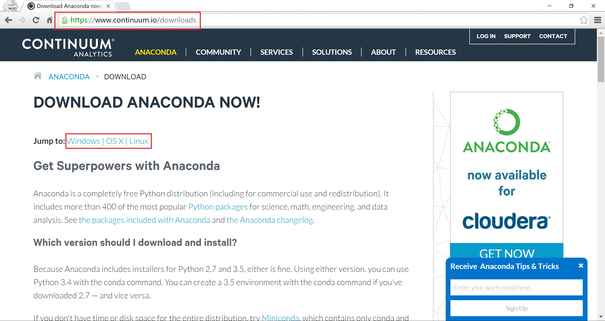
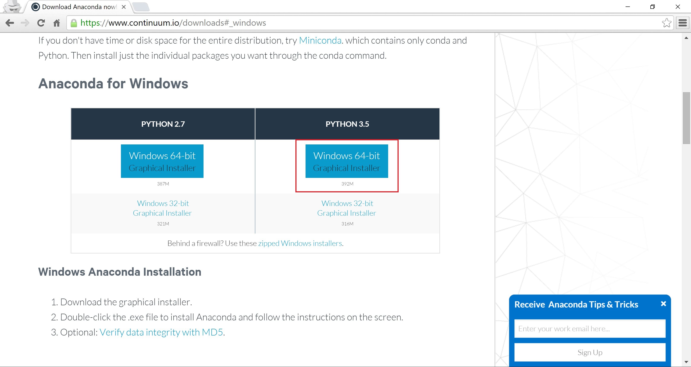
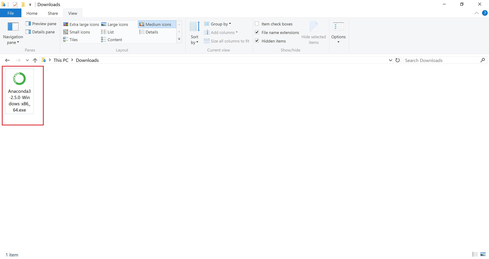
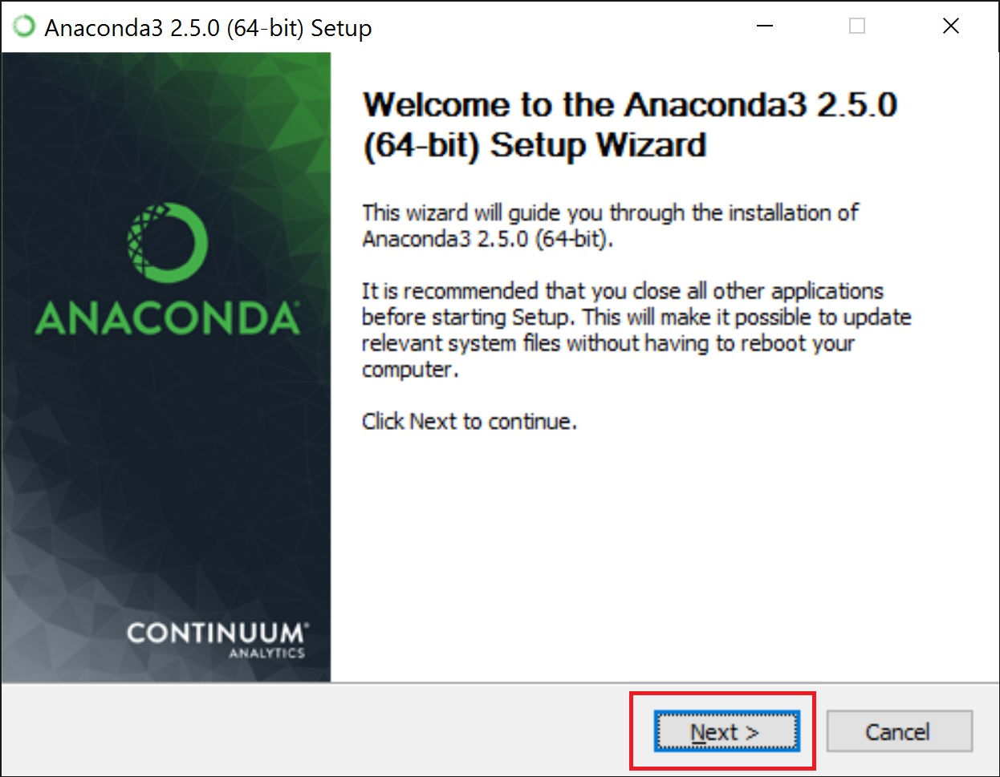
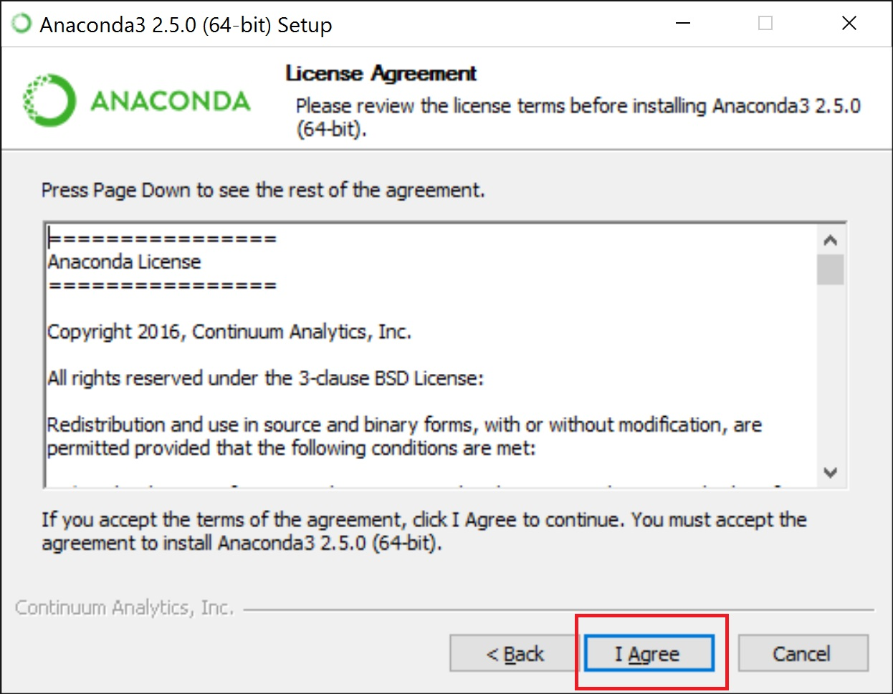
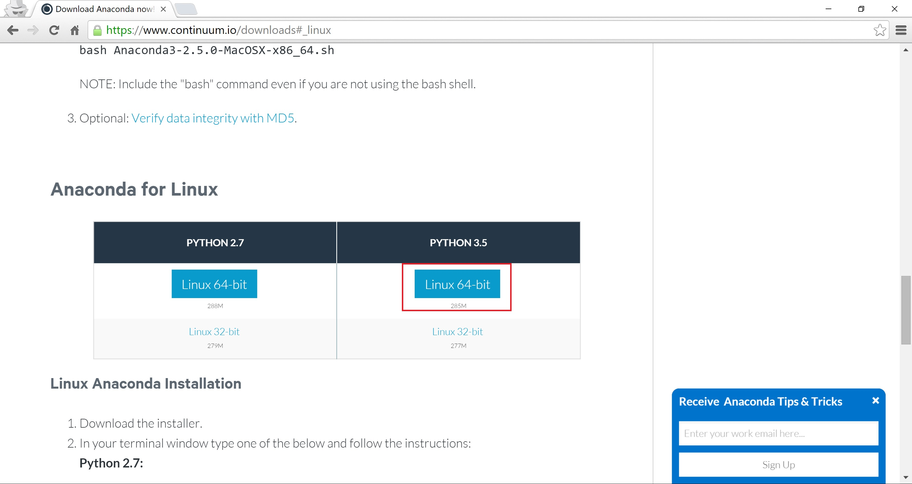

#Instalación de Python

## Anaconda



### En Windows






### En Linux


### Docker
Necesitas instalar [Docker](https://www.docker.com). Para Windows/OS X es bajar el [Docker Toolbox](https://www.docker.com/products/docker-toolbox). Para usar Anaconda ejecutar`(en el consola de Docker o con sudo en Linux)

```
docker run -i -t continuumio/anaconda3 /bin/bash
```
Esto te permite ejecutar una consola en el container ese en particular.

Una buena opción es traerse también los contenedores de [Jupyter](https://github.com/jupyter/docker-stacks), como

```
docker run -d -p 8888:8888 jupyter/datascience-notebook
```
Este comando crea un Jupyter notebook en el puerto 8888, con Python 3.x, R v3.2.x y Julia v0.3.x. También está la versión con Apache Spark v1.6.0
```
docker run -d -p 8888:8888 jupyter/all-spark-notebook
```